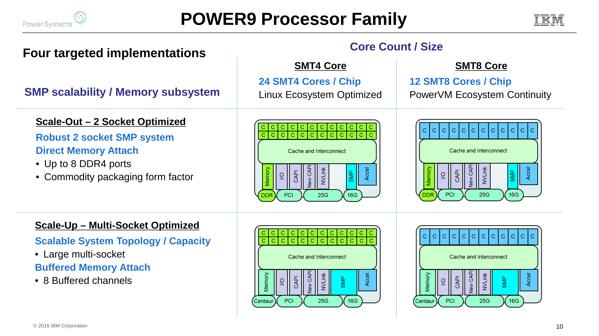

# random-stuff

## POWER9 Chip Types

This chart was extracted from the slide deck of Jeff Stuecheli's POWER9 presentation to the AIX Virtual User Group. I made the rendered out image large enough to make the processor diagrams be at their native size. The IBM and Power Systems logos are faded because the PDF has them broken into hundreds of tiny images for some stupid reason.

||OpenPOWER/PowerNV|PowerVM
-|-|-
**Scale out**|Nimbus|?
**Scale up**||Cumulus

## Amiga Power Chips

Machine|Motherboard|CPU|ISA
-|-|-|-
AmigaONE X5000 | Cyrus | *e5500-core** | Power v2.06**
AmigaONE X1000 | Nemo | PA6T-1682M | Power v2.04

*no specific part listed  
**incomplete support, AltiVec is missing for example

### More Links
* [AmigaONE X5000 page](http://www.a-eon.com/index.php?page=x5000) at AEON site - mostly store links ATM
* [AmigaONE X1000 page](http://www.a-eon.com/index.php?page=x1000) at AEON site
* [Nemo page](http://www.a-eon.com/?page=nemo) at AEON site
* [AmigaONE X5000 ArsTechnica review](https://arstechnica.com/gadgets/2017/05/the-a-eon-amiga-x5000-reviewed-the-beloved-amiga-meets-2017/)
* [amigaworld.net forum posts on X3500 model](http://amigaworld.net/modules/newbb/viewtopic.php?topic_id=39529&forum=33)

## Power Architecture SIMD

The newer vector instructions are called *Vector-Scalar Extension* (VSX); but the older instructions are have different names: IBM calls them *Vector Media Extensions* (VMX); Freescale, *AltiVec*; and Apple, *Velocity Engine*. The AES instructions don't have a fancy name as far as I can tell.

The Power ISA document for version 2.07B barely even mentions VMX, and version 3.0B never mentions VMX at all. So my impression here is that VSX is a superset of the VMX/AltiVec/Velocity-Engine specification. Otherwise, how could you never mention it in the version 3.0B spec?

A table for Vector support [in IBM's compiler documentation](https://www.ibm.com/support/knowledgecenter/SSGH2K_13.1.0/com.ibm.xlc131.aix.doc/compiler_ref/opt_arch.html):

<table><thead>
	<tr><th>Architecture</th><th>Graphics support</th><th>Square root support</th><th>64-bit support</th><th>Vector processing support</th><th>Large page support</th></tr>
	</thead><tbody>
	<tr><td>pwr4</td><td>yes</td><td>yes</td><td>yes</td><td>no</td><td>yes</td></tr>
	<tr><td>pwr5</td><td>yes</td><td>yes</td><td>yes</td><td>no</td><td>yes</td></tr>
	<tr><td>pwr5x</td><td>yes</td><td>yes</td><td>yes</td><td>no</td><td>yes</td></tr>
	<tr><td>ppc</td><td>yes</td><td>yes</td><td>yes</td><td>no</td><td>yes</td></tr>
	<tr><td>ppc64</td><td>yes</td><td>yes</td><td>yes</td><td>no</td><td>yes</td></tr>
	<tr><td>ppc64gr</td><td>yes</td><td>yes</td><td>yes</td><td>no</td><td>yes</td></tr>
	<tr><td>ppc64grsq</td><td>yes</td><td>yes</td><td>yes</td><td>no</td><td>yes</td></tr>
	<tr><td>ppc64v</td><td>yes</td><td>yes</td><td>yes</td><td>VMX</td><td>yes</td></tr>
	<tr><td>ppc970</td><td>yes</td><td>yes</td><td>yes</td><td>VMX</td><td>yes</td></tr>
	<tr><td>pwr6</td><td>yes</td><td>yes</td><td>yes</td><td>VMX</td><td>yes</td></tr>
	<tr><td>pwr6e</td><td>yes</td><td>yes</td><td>yes</td><td>VMX</td><td>yes</td></tr>
	<tr><td>pwr7</td><td>yes</td><td>yes</td><td>yes</td><td>VMX, VSX</td><td>yes</td></tr>
	<tr><td>pwr8</td><td>yes</td><td>yes</td><td>yes</td><td>VMX, VSX</td><td>yes</td></tr>
</tbody></table>

Also, a paper on Power SIMD [at ResearchGate](https://www.researchgate.net/publication/299472451_Workload_acceleration_with_the_IBM_POWER_vector-scalar_architecture) I am currently reading.

## Raptor Computing Firmware Contest

https://www.raptorcs.com/TALOSII/nic_fw_contest.php

## AMD Secure Processor vs Intel Management Engine

The [AMD Secure Processor][0] (previously called the Platform Security Processor) and Intel's Management Engine, are separate cores running signed code from AMD or Intel that have Direct Memory Access to the rest of your machine.

||ASP|ME
-|-|-
**Location**|on processor chip1|in package/module; earlier versions were in northbridge2
**Architecture**|ARM|x86; earlier versions were ARC
**OS**|TrustZone|Minix; earlier versions ran ThreadX
**Disable completely**|No|No
**Disable after startup**|Unknown|using the *HAP* bit; earlier versions have *AltMeDisable* bit5
**Modify signed code**|No4|No4
**Prevent code being loaded**|Unknown|Corrupt/remove certain ME partitions3
**Operation without ROM?**|Unknown|30 minute *recovery mode* before forced shutdown
**Network Access**|Unknown|Yes (with Intel NIC)

1. You can see it in the die shot in AnandTech's [Mullins architecture article][1].
2. From [this article about ME][2].
3. This is what [me_cleaner][3] does.
4. Might be possible at runtime with exploits.
5. We have [a thread about this][11].

This table is pretty much all I know about the two. Some things I couldn't fit into a table row are:
* [Purism has mentioned][4] that ME controls the ICC, and can cause problems with shutdown if misconfigured. This suggests some kind of deeper involvement with system initialisation that might not be replaceable even if ME could be completely removed.
* In the Q&A portion of a talk on [AMD x86 SMU firmware analysis][5] at 31C3 (the response to the [question at 47:58][6] about firmware verification) an AMD guy says this:
  > The statement about verifying the BIOS code which loads the firmware is a statement with regard to newer products starting with the Mullins product that include a Platform Security Processor where **the Platform Security Processor is the first micro-controller that comes up out of reset**; for the older parts that do not have that, what Rudolf just said is correct.
  So on AMD chips, ASP starts executing first and verifies the x86 firmware.
* Some people noticed that some AGESA (AMD's version of FSP IIRC) updates added options to UEFI to stop it from talking to the ASP/PSP, but there is no indication this stops ASP/PSP (like HAP or AltMEDisable on ME) or affects it in any way.

  The UEFI screenshot from the [original reddit thread][7] says this specifically:
  > **BIOS PSP Support**
  > *Description*
  > Enable/Disable BIOS PSP driver execution (including all C2P/P2C mailbox, Secure S3, fTPM Support)  and the QR code is the URL: `http://www.asrock.com/manual.asp?Model=AB350%20Pro4`
  
## Proprietary Controllers and Software Overview

I am mostly getting my information from [the above mentioned SMU talk][5], Coreboot's [Binary Situation wiki page][8], and Purism's [Freedom Roadmap][9]. If I am missing something, please tell me!

### AMD

Component|Location|Architecture
-|-|-
AMD Secure Processor|on processor chip|ARM Cortex A5
System Management Unit (SMU)|on chip module (not on die?)|LatticeMico32
Integrated Microcontroller (IMC)|southbridge|MCS-51
USB 3 Controllers|?|?

Software is in *AMD Generic Encapsulated Software Architecture* (AGESA) package.

### Intel

Component|Location|Architecture
-|-|-
Management Engine|chip module (or northbridge earlier)|ARC or x86
Platform Controller Hub|southbridge|?

Software is the *Firmware Support Package* (FSP), *Embedded Controller* (EC) code, vBIOS code, and *Management Engine* (ME) code (some of which is burned into the chip and not on FlashROM).

---

*I originally wrote this as part of [a question for the Purism forums][10], although as a new user there I couldn't include all my links; so the version on the [Level1Techs forums](https://forum.level1techs.com/t/amd-vs-intel-proprietary-controllers-and-code/124534) is more complete.  I also [posted this][13] to reddit's /r/privacy, since they talk about this kind of stuff.*

[0]: https://www.amd.com/en/technologies/security
[1]: https://www.anandtech.com/show/7974/amd-beema-mullins-architecture-a10-micro-6700t-performance-preview/2
[2]: https://hardenedlinux.github.io/firmware/2016/11/17/neutralize_ME_firmware_on_sandybridge_and_ivybridge.html
[3]: https://github.com/corna/me_cleaner
[4]: https://puri.sm/posts/deep-dive-into-intel-me-disablement/
[5]: https://events.ccc.de./congress/2014/Fahrplan/events/6103.html
[6]: https://media.ccc.de./v/31c3_-_6103_-_en_-_saal_2_-_201412272145_-_amd_x86_smu_firmware_analysis_-_rudolf_marek
[7]: https://www.reddit.com/r/Amd/comments/7i0meq/psp_disable_option_spotted_in_latest_asrock_bios/
[8]: https://www.coreboot.org/Binary_situation
[9]: https://puri.sm/learn/freedom-roadmap/
[10]: https://forums.puri.sm/t/x86-in-laptops-amd-vs-intel/2441
[11]: https://forum.level1techs.com/t/disabling-intel-management-engine-11-via-undocumented-mode/118795
[13]: https://www.reddit.com/r/privacy/comments/7x1hmm/amd_vs_intel_proprietary_controllers_and_code/
